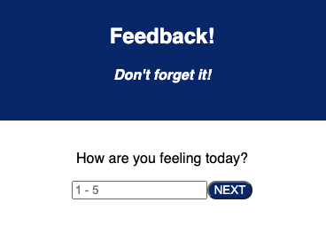
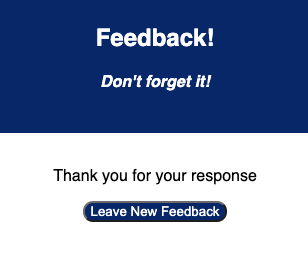

# React Gallery

## Description

Duration: Three day weekend sprint

This project is a multipage feedback form, taking in user feedback and sending it to a database.

## Screen Shot

### Prerequisites

- [Node](https://nodejs.org/en/)

## Installation

1. Create a databse named "prime_feedback".
2. Using the database.sql file provided, initialize a table with the provided data. This project was built with [Postgres](https://www.postgresql.org/download/).
3. Open an editor and run an `npm install` in the terminal
4. To launch the project, run `npm run server` followed by `npm run client`

## Usage

To use the app, enter your feedback and click "next" to move onto the next page. At the end, you can review your submissions and restart the feedback form.

## Built With

- Express
- React
- Redux
- Postgres
- Javascript
- CSS

## Contact

For any questions on this project, contact me at [mahler.sam@gmail.com](mailto:mahler.sam@gmail.com)
